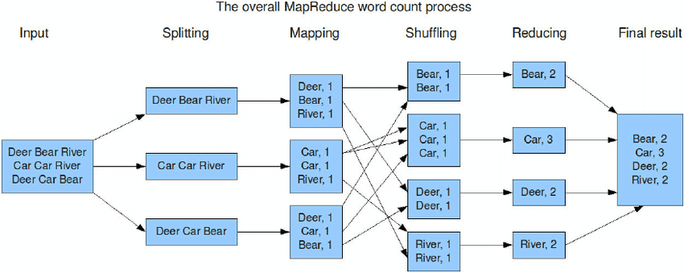
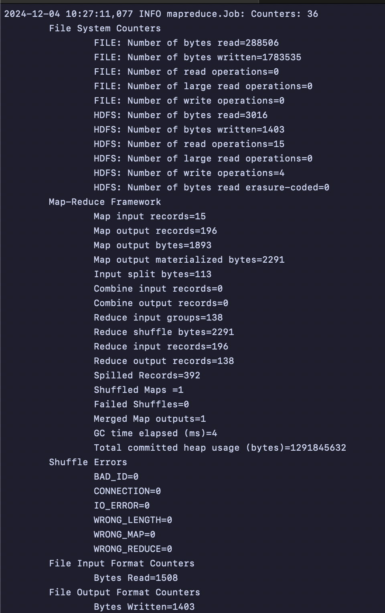

# Word Count Using Hadoop Streaming (MapReduce) and Python (Run Locally)


### **Project Overview**


This project demonstrates the implementation of a classic **Word Count** program using **Apache Hadoop MapReduce** with **Python** as the programming language. The goal is to process a text file, count the occurrences of each word, and output the results efficiently in a distributed computing environment.


The project simulates **MapReduce** functionality on a local machine to provide hands-on experience with big data concepts, making it accessible for learning without requiring a large Hadoop cluster.


---


### **Key Highlights**


- **Hadoop MapReduce Framework**: Implements the distributed computing paradigm to handle large-scale text processing tasks.
- **Python Integration**: Leverages Python scripts for the Mapper and Reducer components to make the program simple and readable.
- **Local Execution**: Executes the Word Count program in a local environment, making it ideal for experimentation and learning.


---


### **How It Works**


1. **Mapper Phase**:
   - Reads the input text line by line.
   - Splits each line into individual words.
   - Emits each word as a key and assigns an initial count of `1`.
2. **Reducer Phase**:
   - Aggregates the counts of each word emitted by the Mapper.
   - Outputs the final count for each word.
3. **Streaming with Hadoop**:
   - The Mapper and Reducer scripts are integrated into the Hadoop Streaming API, which handles the data flow between the two phases.


---





---


### **Purpose of the Project**


- Gain hands-on experience with the **MapReduce programming model**.
- Understand the integration of **Python with Hadoop Streaming**.
- Learn how to simulate and execute big data tasks on a local machine.
- Develop skills in distributed data processing and text analysis.


---


### How to run:


1. Install Hadoop and Java (you must install Java 8 or 11; other versions are not supported by Hadoop). You can follow this guide:
https://levelup.gitconnected.com/install-hadoop-on-macos-efe7c860c3ed
https://medium.com/@DataEngineeer/how-to-set-up-hadoop-on-windows-a-step-by-step-guide-37d1ab4bee57


  
   Start Hadoop Services:
  


```sql
start-dfs.sh
start-yarn.sh
```


2. Prepare Input Files :  Create a directory in the Hadoop HDFS by using the following command:


```sql
hadoop fs -mkdir /user/hadoop/input
```


Copy you input file from your local directory to the Hadoop HDFS


```sql
hadoop fs -copyFromLocal /path/to/local/input_file.txt /user/hadoop/input
```


3. Verify Files in HDFS : Confirm the input files have been successfully uploaded


```sql
hdfs dfs -ls /user/hadoop/input
```


This is how to read the input file inside Hadoop HDFS:


```sql
hdfs dfs -cat /user/hadoop/input/*
```


This is how to remove output path(if already applied):


```sql
hdfs dfs -rm -r /user/hadoop/output
```


4. Run the Hadoop Job: Execute the Hadoop job using the appropriate jar file or command


```sql
hadoop jar /path/to/hadoop-streaming.jar \
   -input /path/to/input_directory \
   -output /path/to/output_directory \
   -mapper /path/to/mapper.py \
   -reducer /path/to/reducer.py
```


Replace:


- `/path/to/your/hadoop_program.jar` with the path to your compiled jar file.
- `MainClassName` with the name of your program’s main class.
- `/user/hadoop/input` with the input directory in HDFS.
- `/user/hadoop/output` with the desired output directory in HDFS.
- **`/path/to/mapper.py`**: Replace with the local path to your Mapper script.
- **`/path/to/reducer.py`**: Replace with the local path to your Reducer script.


```sql
Example:
hadoop jar /opt/homebrew/Cellar/hadoop/3.4.1/libexec/share/hadoop/tools/lib/hadoop-streaming-3.4.1.jar \
-input /user/hadoop/input/pembukaan_uud1945.txt \
-output /user/hadoop/output_new \
-mapper /Users/jeannetaoliviasantoso/ftde_hw2_hadoop/mapper.py \
-reducer /Users/jeannetaoliviasantoso/ftde_hw2_hadoop/reducer.py
```


After running this command, Mapper job start getting executed. After a while Reducer job starts consequently. The details of the job are being displayed in the command prompt.


![Screenshot 2024-12-05 at 8.10.46 PM.png]


if the job is success, the last output will be like this:


5. Check the Job Status: Monitor the job progress through the terminal logs.


ex: [http://localhost:9870/explorer.html#/user/hadoop/output_new/part-00000](http://localhost:9870/explorer.html#/user/hadoop/output_new/part-00000)


6. After the job completes, check the contents of the output directory in HDFS


```sql
hadoop fs -ls /user/hadoop/output
```


7. View the Output: Use the hadoop fs -cat command to display the output


```sql
hadoop fs -cat hadoop fs -cat /user/hadoop/output_new/part-00000
```


8. Download the Output to Your Local System: Copy the output file(s) from HDFS to your local directory


```sql
hadoop fs -copyToLocal /user/hadoop/output/part-00000 /path/to/local/output_directory/output_file_name.txt


example:
fs -copyToLocal /user/hadoop/output_new/part-00000 /Users/jeannetaoliviasantoso/hadoop_hw/output
```


9. Customize the Output File Name (Optional) : If you prefer a custom output file name, rename it during the `copyToLocal`


```sql
hadoop fs -copyToLocal /user/hadoop/output/part-00000 /path/to/local/output_directory/custom_name.txt


example:
hadoop fs -copyToLocal /user/hadoop/output_new/part-00000 /Users/jeannetaoliviasantoso/ftde_hw2_hadoop/output/output_word_count.txt


```


10. Stop the Hadoop Services (Optional)


```sql
stop-dfs.sh
stop-yarn.sh


```

